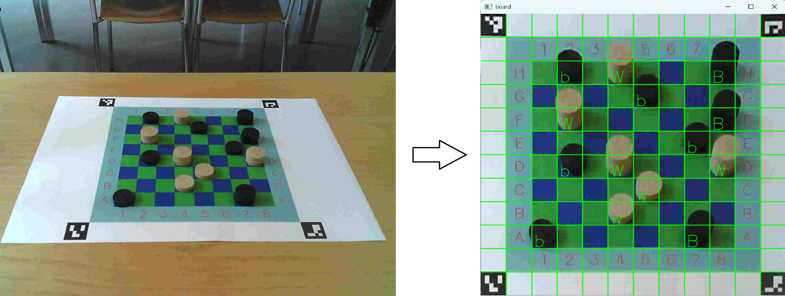

# Checkers Detector

This is a mini-project for the image processing 3 course of the [FHGR B.Sc. Mobile Robotics], implemented
by [Ralph Ursprung].

This application implements the detection of pieces on a [checkers] board. It uses a single camera for this and
relies on using a custom board to identify the pieces. The board comes with four [ArUco markers] to mark the corners
to more easily identify the board in the image.
Since this project does not use stereo vision it relies purely on colour segmentation to identify the pieces, which is
the reason why the board is using custom colours for the fields to ensure that the colours are different enough between
the stones and the fields. Additionally, it relies on the fact that checkers only allows placing pieces on the dark
fields - which in our case are blue.



## Installation / Dependencies

Since this uses [OpenCV](https://opencv.org/) using the [`opencv` crate](https://crates.io/crates/opencv) you first
need to install OpenCV in some way. This has been tested by installing OpenCV using [`vcpkg`](https://vcpkg.io/):

```bash
${VCPKG_ROOT}/vcpkg install opencv[ffmpeg,contrib]
```

If you do not wish to use `vcpkg` then you should disable the default features.

This has been tested against OpenCV 4.11 and is not guaranteed to work with other (especially older) versions.

## Board Generator

Since the detector relies on a custom board you'll have to print one yourself. You can just print the [provided board]
or generate one yourself with the desired number of fields. Run this for more information on the available options:

```bash
cargo run --release --bin board-generator -- -h
```

## Detector

### Usage

The camera must be in a fixed position relative to the board, facing it from the front and looking down on it at
roughly a 30° angle. Do not move the camera once you've calibrated it, otherwise the recognition of men vs. kings will
be wrong.

Run the application with `--help` or `-h` to see all supported parameters (not all are documented here).

The detector shows "b" for black pieces and "w" for white pieces and, once calibrated, the uppercase versions thereof
to indicate kings.

You can left-click any field to see the same information in the console.

#### With Static Images

You can run the application with static images:

#### With Live Camera

The camera supports a live video feed:

```bash
cargo run --release --bin checkers-detector -- --video-input http://my-camera-webserver/stream
```

##### Specific Support for ESP32 CAM

If you're using an ESP32 CAM with [ESP32 CameraWebServer], explicit support has been built in to set the correct
settings and deduce the stream URL. For this you have to specify the camera type:

```bash
cargo run --release --bin checkers-detector -- --video-input http://my-esp32-cam/ --camera-type esp32-cam
```

Support for other camera types can easily be added if needed, as long as they provide a video stream supported by
OpenCV.

### Calibration

In order to correctly recognise whether a piece is a man or a king you need to place the following pieces (field names
given for an 8✕8 board):

* a man on the top left blue field (H2)
* a king on the top right blue field (H8)
* a man on the bottom left blue field (A1)
* a king on the bottom right blue field (A7)

Once these pieces have been recognised the application will switch to a calibrated setup and start displaying the
information about kings.

#### Calibration For Static Images

If your image does not contain the pieces needed for the calibration you can instead provide a JSON file with the same
name as the image (e.g. `foo.json` for `foo.jpg`) and provide the calibration information in it.

### Development Information

You can use `-F show_debug_screens` when building the project to enable additional debug output which remains disabled
otherwise.
Namely, this includes displaying the masks for the pieces and allow middle and right clicks to print HSV information
for the specific location.

## License

As this is purely an educational project there's no need for others to include it in their commercial works.
Accordingly, this is licensed under the **GNU General Public License v3.0 or later** (SPDX: `GPL-3.0-or-later`).
See [LICENSE](LICENSE) for the full license text.

[FHGR B.Sc. Mobile Robotics]: https://fhgr.ch/mr
[Ralph Ursprung]: https://github.com/rursprung
[Checkers]: https://en.wikipedia.org/wiki/Checkers
[ArUco markers]: https://docs.opencv.org/4.x/d5/dae/tutorial_aruco_detection.html
[provided board]: resources/chessboard.png
[ESP32 CameraWebServer]: https://github.com/espressif/arduino-esp32/tree/master/libraries/ESP32/examples/Camera/CameraWebServer
